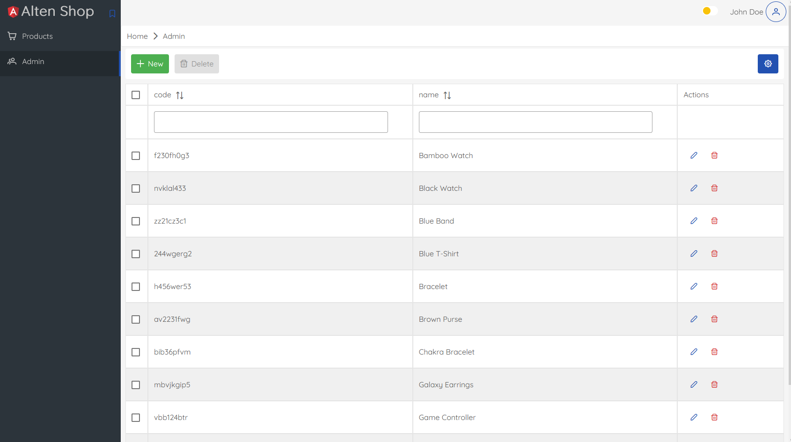
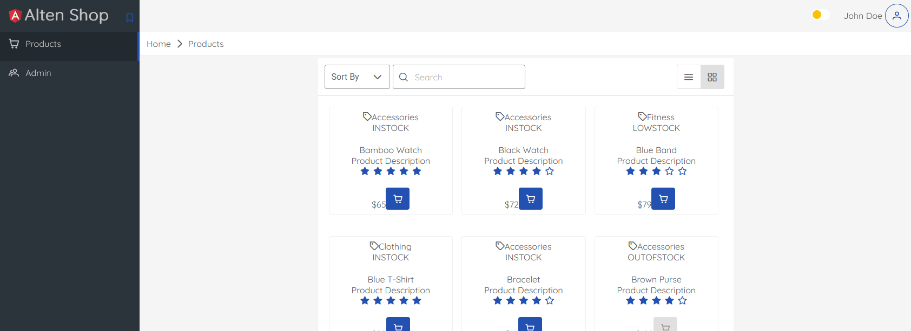

# Réalisations Front-end
  - **Partie-Admin** : 
       - Consultation des Produits
       - Adminstration des produits :
          - Ajout un produit
          - Suppression d'un ou plusieur Produit 
          - Mise à jour d'un produit
       - sécurisation des routes admin via des guards
       - Mise en place des interceptors pour injecter le token lors de l'envoi d'une requête 
  
  - **Partie-USER** : 
      
       - Lecture et consultation des produits soit mode grid ou liste 
       [En Mode Grid](docs/grid.png)
       [En Mode List](docs/list.png)
   
   - **Parties-Communes** : 
      
      - Authenfication (login & logout ) via une interface dédiée 
      - Mise en place des services qui manage un token 


# Réalisations Back-end

   - **Overview** : 

   Mise en place d'une API RESTfu, avec spring boot, permet de gérer les produits d'une manière complète en suivant le modèle CRUD (Create, Read, Update, Delete). Elle expose des endpoint pour créer, lire, mettre à jour et supprimer des produits.

   - **Parite Fonctionnalités** : 

    - L'API fournit les opérations fondamentales de CRUD pour les produits :
     - Créer un produit  -> Endpoint : `POST /api/admin/products`
     - Lire un Prduit    -> Endpoint : `GET /api/products/{id}` &&  Endpoint : `GET /api/products`
     - Mettre à jour un produit -> Endpoint `PATCH  /api/admin/products`
     - Suppression d'un ou plusieur  produits -> Endpoint `DELETE  /api/admin/products/{id}` `/api/admin/products` 

   Une fois l'application démarrée, elle persiste une liste de produits, disponible dans le dossier  `backEnd/src/main/ressources/products.json`

   - **Documentation Swagger** :

   Pour faciliter la compréhension de cette API, la documentation est disponinle via swagger [swagger](/docs/swagger.png)
     - Pour accéder à la documentation swagger lorsque l'application en cours d'exécution : http://localhost:8085/swagger-ui/index.html
    
   - **Architecture** :

   L'API est conçu selon une architecture en couche, permettant une séparation claire des responsabilité et une meilleure gestion de la complexité. [Architecture](/docs/architecture.png). Les trois couches sont faiblement couplé, c'est à dire qu'elle sont liées via des interfaces. 

   La première couche, REST API, a la responsabilité de capturer les requêtes et de dispatcher l'opération à la couche de service. Cette dernière a pour rôle d'effectuer les traitements administratifs dans le contexte de cette application, ainsi que de récupérer et de persister les données dans la couche DAO (repository) lorsque cela est nécessaire.

   - **Détail Technique** :

Dans l'API, un ensemble de bonnes pratiques techniques a été mis en place, notamment :

      - Les DTO d'entrée et de sortie qui valident les données selon le format attendu.
      - Les mappers qui assurent la conversion des données d'un format à un autre.
      - Un gestionnaire d'exceptions qui centralise la gestion des erreurs.
      - La configuration de Logback et du logger pour tracer les messages.
      - Les tests unitaires et la mesure de la couverture de code avec JaCoCo.
      - Hibernate ORM pour la gestion de la persistance des données.
      - L'empaquetage des images de l'API et de l'application Angular configuré dans un Dockerfile, avec Docker Compose.
      - Docuementation swagger 
      - Mise en place du module spring sécurité pour l'authentification et l'autorisation 
      - Spring Data pour la gestion des opérations de persistance.


   - **Lancement de l'application** :

   Pour lancer l'application, il suffit d'éxécuter une commande docker compose suivante : docker-compose up --build. 
   une fois les conteneurs démarrés, vous pouvez accéder à l'application : 
       
       - Coté front  Angular :  (http://localhost:4200)
       - coté Back API : http://localhost:8085
       - Console h2 databse : http://localhost:8085/h2-console
       - http://localhost:8085/swagger-ui/index.html


   


# Spécification Front-end

Créer un module angular "product" avec 2 composants (basés sur primeng): 
 - **products-admin** : qui liste les produits et qui permet de les administrer (ajouter, supprimer, modifier).
    Il doit être accessible à cette adresse : http://localhost:4200/admin/products
 - **products** : qui liste les produits en mode lecture seule, comme sur une boutique en ligne.
    Il doit être accessible à cette adresse : http://localhost:4200/products

Une liste de produit est disponible dans le dossier assets : `front/assets/products.json`.

Le service qui permettra de manipuler les produits doit se baser sur cette liste et être prêt à être connecté sur une API Rest ultérieurement

Le design cible est visible sur les captures d'écrans ci-dessous (et disponibles dans le dossier `front/doc`).

**Pour la partie Admin :**


Nous vous conseillons d'utiliser le composant table de [PrimeNG](https://primeng.org/table/filter) avec les options filtre, edit, page, etc...

 **Pour la partie publique :**


Nous vous conseillons d'utiliser le composant data view de [PrimeNG](https://primeng.org/dataview) avec les options sort, search, page, etc...


Le menu latéral gauche doit contenir les accès à ces 2 composants.

Un système de pagination doit être mis en place pour pouvoir afficher les produits par 10, 25 ou 50 comme ci-dessous :


# Spécification Back-end (optionnel)

Si vous avez le temps vous pouvez développer un back-end permettant la gestion de produits définis plus bas.
Vous pouvez utiliser la technologie de votre choix parmis la liste suivante :

- nodejs/express
- Java/Spring Boot
- C#/.net Core
- Python/Flask


Le back-end doit gérer les API suivantes : 

| Resource           | POST                  | GET                            | PATCH                                    | PUT | DELETE           |
| ------------------ | --------------------- | ------------------------------ | ---------------------------------------- | --- | ---------------- |
| **/products**      | Create a new products | Retrieve all products          | X                                        | X   |     X            |
| **/products/1**    | X                     | Retrieve details for product 1 | Update details of product 1 if it exists | X   | Remove product 1 |

Un produit a les caractéristiques suivantes : 

``` typescript
class Product {
  id: number;
  code: string;
  name: string;
  description: string;
  price: number;
  quantity: number;
  inventoryStatus: string;
  category: string;
  image?: string;
  rating?: number;
}
```

Le back-end créé doit pouvoir gérer les produits dans une base de données SQL/NoSQL ou dans un fichier json.

## Bonus

Vous pouvez ajouter des tests Postman ou Swagger pour valider votre API
